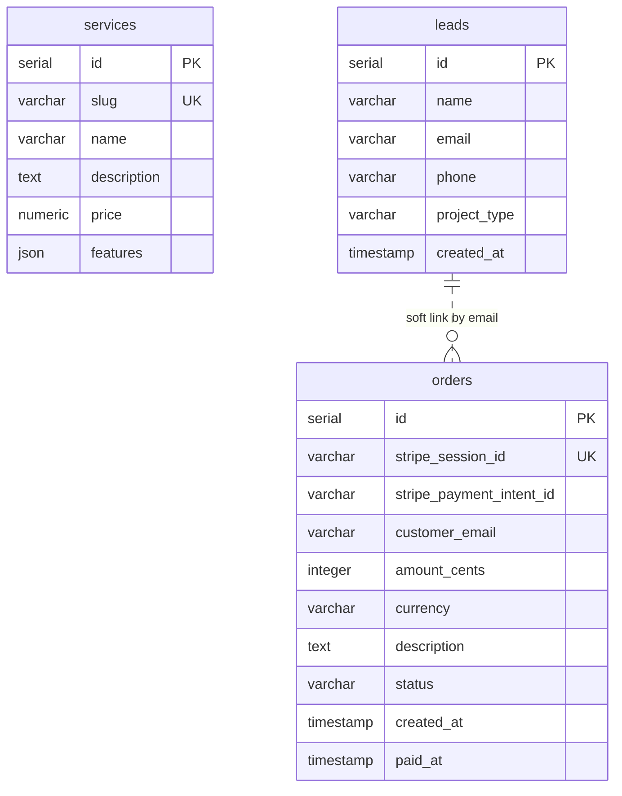

# 🗄️ Database Schema — TechNova

> **Fuente de verdad:** [`src/db/schema.ts`](../../src/db/schema.ts). Este doc se mantiene a mano — si modificas el schema, actualiza también este archivo.
> **Provider:** Neon Postgres (serverless).
> **ORM:** Drizzle ORM ^0.45.2.
> **Última verificación:** 2026-05-20.

---

## 📋 Tabla de Contenidos

1. [Diagrama ER](#diagrama-er)
2. [Tabla `services`](#tabla-services)
3. [Tabla `leads`](#tabla-leads)
4. [Tabla `orders`](#tabla-orders)
5. [Relaciones](#relaciones)
6. [Constraints & validaciones](#constraints--validaciones)
7. [Migrations & versionado](#migrations--versionado)
8. [Seeding](#seeding)
9. [Performance & consideraciones](#performance--consideraciones)

---

## Diagrama ER

```
┌─────────────────────────────────┐
│           services              │
├─────────────────────────────────┤
│ id              serial PK       │
│ slug            varchar(255) U  │
│ name            varchar(255)    │
│ description     text            │
│ price           numeric         │
│ features        json            │
└─────────────────────────────────┘
       (catálogo — sin relaciones formales todavía)


┌─────────────────────────────────┐
│            leads                │
├─────────────────────────────────┤
│ id              serial PK       │
│ name            varchar(255)    │
│ email           varchar(255)    │
│ phone           varchar(20)?    │
│ project_type    varchar(255)?   │
│ created_at      timestamp       │
└─────────────────────────────────┘
                  │
                  │ (vinculación blanda por email,
                  │  sin FK formal — ver §5)
                  ▼
┌─────────────────────────────────────────────┐
│                  orders                     │
├─────────────────────────────────────────────┤
│ id                          serial PK       │
│ stripe_session_id           varchar(255) U  │
│ stripe_payment_intent_id    varchar(255)?   │
│ customer_email              varchar(255)    │
│ amount_cents                integer         │
│ currency                    varchar(3)='mxn'│
│ description                 text?           │
│ status                      varchar(32)     │
│ created_at                  timestamp       │
│ paid_at                     timestamp?      │
└─────────────────────────────────────────────┘
```

**Leyenda:** `PK` = primary key · `U` = unique · `?` = nullable.

Versión Mermaid (renderable en GitHub):



---

## Tabla `services`

Catálogo de paquetes/servicios que vendemos. Por ahora vive principalmente en código (`src/data/`) y este table no se consulta activamente; está preparada para poblar con drizzle-kit seed cuando los precios queden fijos.

| Columna | Tipo | Null | Default | Notas |
|---------|------|------|---------|-------|
| `id` | `serial` | NO | autoincr | Primary key |
| `slug` | `varchar(255)` | NO | — | **UNIQUE.** ej. `start`, `growth`, `scale`, `landing-page`. |
| `name` | `varchar(255)` | NO | — | Nombre visible. |
| `description` | `text` | NO | — | Descripción larga. |
| `price` | `numeric` | NO | — | Precio base. La moneda no está en la tabla — convención: MXN. Si vamos multi-moneda, añadir columna `currency`. |
| `features` | `json` | NO | — | Array de strings (features del plan). Drizzle infiere `unknown`; conviene castear `as string[]` al leer. |

### Índices

- `services_pkey` (automático sobre `id`)
- `services_slug_unique` (automático por `unique()`)

---

## Tabla `leads`

Capturas del lead magnet **"Auditoría Web Express"** y otros formularios. Cada fila representa un contacto interesado.

| Columna | Tipo | Null | Default | Notas |
|---------|------|------|---------|-------|
| `id` | `serial` | NO | autoincr | Primary key |
| `name` | `varchar(255)` | NO | — | Si no llega del form, `/api/leads` usa `"Usuario Auditoría"` como fallback. |
| `email` | `varchar(255)` | NO | — | Validado con Zod (`.email()`) antes del insert. |
| `phone` | `varchar(20)` | **SÍ** | — | Opcional. Tipo de origen heterogéneo (con/sin +52, con/sin espacios). Validación blanda. |
| `project_type` | `varchar(255)` | **SÍ** | — | ej. `"Auditoría Express"`, `"Landing Page"`. |
| `created_at` | `timestamp` | SÍ | `defaultNow()` | Cuándo se capturó. |

### Índices

- `leads_pkey` (automático sobre `id`)
- ⚠️ **NO hay UNIQUE en email.** Decisión consciente: un mismo email puede llegar por múltiples canales/campañas y queremos preservar cada touch. Para deduplicar, query agrupada por email al exportar.
- ⚠️ **NO hay índice en `created_at` ni `email` todavía.** Cuando el volumen pase de ~10K, añadir:
  ```sql
  CREATE INDEX idx_leads_email ON leads(email);
  CREATE INDEX idx_leads_created_at ON leads(created_at DESC);
  ```

---

## Tabla `orders`

Órdenes de pago Stripe. Cada Checkout Session crea una fila como `pending`; el webhook la transiciona a `paid` (o `expired`/`refunded`/`disputed`).

| Columna | Tipo | Null | Default | Notas |
|---------|------|------|---------|-------|
| `id` | `serial` | NO | autoincr | Primary key |
| `stripe_session_id` | `varchar(255)` | NO | — | **UNIQUE.** ID de `Stripe.Checkout.Session` (ej. `cs_test_a1b2…`). Garantiza idempotencia. |
| `stripe_payment_intent_id` | `varchar(255)` | **SÍ** | — | Se llena cuando el webhook recibe `checkout.session.completed` (la session tiene el PI ya). Permite cross-reference con `charge.refunded` / `dispute.created`. |
| `customer_email` | `varchar(255)` | NO | — | Mismo email del Lead. Vinculación blanda (no FK). |
| `amount_cents` | `integer` | NO | — | **En centavos.** $18,000 MXN → `1800000`. Evita float drift. |
| `currency` | `varchar(3)` | NO | `'mxn'` | ISO 4217. Hoy solo MXN; cuando expandamos, validar contra enum. |
| `description` | `text` | **SÍ** | — | Texto libre que se muestra en Stripe Checkout y en el recibo. ej. `"Plan GROWTH - Sitio web + CMS"`. |
| `status` | `varchar(32)` | NO | `'pending'` | Estados posibles: `pending`, `paid`, `expired`, `refunded`, `disputed`. Flujo en §6. |
| `created_at` | `timestamp` | SÍ | `defaultNow()` | Cuándo se creó la Session. |
| `paid_at` | `timestamp` | **SÍ** | — | Se llena cuando llega `checkout.session.completed`. |

### Índices

- `orders_pkey` (automático)
- `orders_stripe_session_id_unique` (automático)
- ⚠️ **Pendiente añadir** cuando crezca volumen:
  ```sql
  CREATE INDEX idx_orders_status ON orders(status);
  CREATE INDEX idx_orders_customer_email ON orders(customer_email);
  CREATE INDEX idx_orders_stripe_payment_intent_id ON orders(stripe_payment_intent_id);
  ```
  El último es importante porque `charge.refunded` busca por `payment_intent_id`, no por `session_id`.

### Diagrama de estados

```
                  ┌─────────┐
                  │ pending │   ← creado por POST /api/checkout
                  └────┬────┘
                       │
       ┌───────────────┼──────────────┐
       │               │              │
checkout.session  checkout.session    (otros casos
.completed        .expired             — manuales)
       │               │
       ▼               ▼
   ┌──────┐       ┌─────────┐
   │ paid │       │ expired │
   └──┬───┘       └─────────┘
      │
      │   charge.refunded
      │
      ▼
  ┌──────────┐
  │ refunded │
  └──────────┘

  charge.dispute.created (desde paid)
      │
      ▼
  ┌──────────┐
  │ disputed │
  └──────────┘
```

---

## Relaciones

### Estado actual: **sin foreign keys formales**

Razones:
- **MVP-friendly:** podemos eliminar/cambiar tablas sin orquestar migraciones de FK.
- **Email como join key:** `leads.email` y `orders.customer_email` se vinculan por convención (join manual cuando se necesite).
- **Drizzle relaciones:** no se han definido todavía con `relations()` helper.

### Cuándo formalizar relaciones

Añadir FKs cuando:
- Se exponga un dashboard de cliente que muestre "mis órdenes" (necesitas garantía referencial).
- Implementemos el plan SCALE con suscripciones (necesitas `subscriptions` con FK a `customers` u `orders`).
- Crezca el dominio: `projects`, `invoices`, etc.

Plan futuro:
```ts
// src/db/schema.ts (sketch — NO IMPLEMENTADO)
export const customers = pgTable('customers', {
  id: serial('id').primaryKey(),
  email: varchar('email', { length: 255 }).notNull().unique(),
  // ...
});

export const orders = pgTable('orders', {
  // ...
  customer_id: integer('customer_id').references(() => customers.id),
});
```

---

## Constraints & validaciones

### A nivel DB

| Constraint | Tabla.columna | Tipo |
|------------|---------------|------|
| Primary key | `services.id`, `leads.id`, `orders.id` | implícito |
| Unique | `services.slug` | `unique()` en Drizzle |
| Unique | `orders.stripe_session_id` | `unique()` en Drizzle |
| Not null | la mayoría de columnas | `notNull()` en Drizzle |
| Default | `leads.created_at`, `orders.created_at` | `defaultNow()` |
| Default | `orders.currency` | `'mxn'` |
| Default | `orders.status` | `'pending'` |

### A nivel aplicación (Zod)

Cada endpoint valida con Zod **antes** de insertar (defensiva en profundidad).

```ts
// src/app/api/leads/route.ts
const leadSchema = z.object({
  email: z.string().email('Email inválido'),
  name: z.string().min(1).max(255).optional(),
  phone: z.string().min(1).max(20).optional(),
  project_type: z.string().min(1).max(255).optional(),
});

// src/app/api/checkout/route.ts
const checkoutSchema = z.object({
  email: z.string().email(),
  amount_mxn: z.number().int().positive().max(1_000_000), // cap defensivo
  description: z.string().min(1).max(500),
  plan: z.enum(['START', 'GROWTH', 'SCALE', 'custom']).optional(),
});
```

### Pendiente (deuda baja)

- **CHECK constraint** sobre `orders.status` para que solo acepte los 5 estados conocidos:
  ```sql
  ALTER TABLE orders ADD CONSTRAINT orders_status_check
    CHECK (status IN ('pending', 'paid', 'expired', 'refunded', 'disputed'));
  ```
- **CHECK** sobre `orders.amount_cents > 0`.
- **CHECK** sobre `orders.currency` en lista de monedas soportadas.

---

## Migrations & versionado

### Stack

- **Drizzle Kit** (`drizzle-kit ^0.31.10`) maneja generación de migrations y sync.
- Config en [`drizzle.config.ts`](../../drizzle.config.ts) — apunta a `src/db/schema.ts` como fuente y `./drizzle/` como output.

### Modo actual: `drizzle-kit push` (sync directo)

Ideal para MVP y dev. Compara el schema con la DB real y aplica los cambios necesarios.

```bash
# Desde la raíz del proyecto, con .env cargado:
npx drizzle-kit push
```

Lo usamos en producción la primera vez para crear la tabla `orders`. **Pros:** rápido. **Cons:** no hay archivo migration committeado.

### Modo recomendado a futuro: generate + migrate

Cuando el proyecto crezca y queramos historial versionado de cambios DB:

```bash
# 1. Generar el archivo SQL de la diff
npx drizzle-kit generate

# 2. Aplicar las migrations pendientes
npx drizzle-kit migrate
```

Los archivos quedan en `drizzle/` y se commitean. Útil para rollback, audit, y para que otros devs/CI sepan exactamente qué cambia.

### Workflow recomendado al cambiar el schema

1. Edita `src/db/schema.ts` (añade tabla, columna, índice, etc.).
2. Localmente: `npx drizzle-kit push` para validar contra tu DB de dev.
3. Actualiza este doc (`DATABASE_SCHEMA.md`) con la nueva columna/tabla.
4. Si el cambio es destructivo (drop column, drop table), avisa en BITACORA antes de mergear.
5. En producción: Vic corre `npx drizzle-kit push` tras mergear a main (no es automático en Vercel — es deliberado, para no tirar la DB por accidente).

---

## Seeding

### Estado actual: sin seed automático

No existe `src/db/seed.ts` todavía. La tabla `services` está vacía en Neon; los planes hoy viven hardcoded en [`src/data/inventory.ts`](../../src/data/inventory.ts) y se muestran desde ahí.

### Cuándo crear seed

- Cuando definamos los precios MXN finales y queramos consultarlos desde DB en vez de hardcode.
- Para tests de integración (poblar DB de test con fixtures).

### Sketch de seed futuro

```ts
// src/db/seed.ts (NO EXISTE TODAVÍA)
import { db } from './index';
import { services } from './schema';

async function seed() {
  await db.insert(services).values([
    {
      slug: 'start',
      name: 'Paquete START',
      description: 'Landing page de alta conversión...',
      price: '6500',
      features: ['Landing page', 'Hosting', 'WhatsApp integration', 'SEO básico'],
    },
    {
      slug: 'growth',
      name: 'Paquete GROWTH',
      description: 'Sitio multi-página o eCommerce...',
      price: '22500',
      features: ['Sitio Next.js', 'CMS', 'Email automation', 'SEO avanzado'],
    },
    {
      slug: 'scale',
      name: 'Paquete SCALE',
      description: 'Sistemas a medida con IA y agentes...',
      price: '35000',
      features: ['Custom software', 'AI integration', 'CRM personalizado'],
    },
  ]);
}

seed().then(() => process.exit(0));
```

Ejecutar con `npx tsx src/db/seed.ts` (tsx ya está instalado para correr TS sin compilar).

---

## Performance & consideraciones

### Queries esperadas en el corto plazo

| Query | Frecuencia | Tabla | Plan |
|-------|-----------|-------|------|
| `INSERT lead` | alta (cada captura) | `leads` | Index PK suficiente. |
| `INSERT order pending` | media (cada checkout) | `orders` | Index PK + unique en session_id. |
| `UPDATE order SET status='paid' WHERE stripe_session_id=...` | media (cada webhook completed) | `orders` | Unique index ya cubre. |
| `UPDATE order SET status='refunded' WHERE stripe_payment_intent_id=...` | baja | `orders` | ⚠️ **Sin índice todavía** — añadir cuando volumen crezca. |
| `SELECT leads BY email` (para deduplicar export) | manual | `leads` | Sin índice — fine al volumen MVP. |

### Cuando añadir índices

Regla: si una query se ejecuta más de ~10/min y el `EXPLAIN ANALYZE` muestra Seq Scan sobre > 1000 filas, añadir índice.

### N+1 a evitar

Hoy no hay riesgo (no hacemos joins). Cuando se añadan, usar Drizzle `with:` para eager-load:

```ts
// Ejemplo a futuro con relaciones definidas
const customer = await db.query.customers.findFirst({
  where: eq(customers.id, 1),
  with: { orders: true }, // evita N+1
});
```

### Connection pooling

El driver HTTP de Neon (`@neondatabase/serverless`) **no necesita pool**: cada request abre una conexión HTTP corta. Ideal para Vercel Functions que arrancan y mueren rápido. No usar pgBouncer ni similares con este driver.

### Backups

Neon hace **branching automático**: cada PR puede tener su DB-copia. Para backup formal:
- **Free tier:** Neon hace snapshots automáticos (PITR — Point-in-Time Recovery) de los últimos 7 días.
- **Scale:** Configurar export periódico vía `pg_dump` cuando el negocio lo amerite.

---

## Para seguir leyendo

- [`TECHNICAL_ARCHITECTURE.md`](./TECHNICAL_ARCHITECTURE.md) — visión global del stack.
- [`API_DOCUMENTATION.md`](./API_DOCUMENTATION.md) — cómo los endpoints usan estas tablas.
- [`ONBOARDING_DEVELOPER.md`](./ONBOARDING_DEVELOPER.md) — cómo conectar a la DB local.
- [`../../DECISION_LOG.md`](../../DECISION_LOG.md) — D-002 (Drizzle + Neon), D-011 (Neon vs Supabase).

---

**Última actualización:** 2026-05-20
**Próxima revisión:** cuando se añada tabla nueva, FK, índice, o se cambie un tipo.
